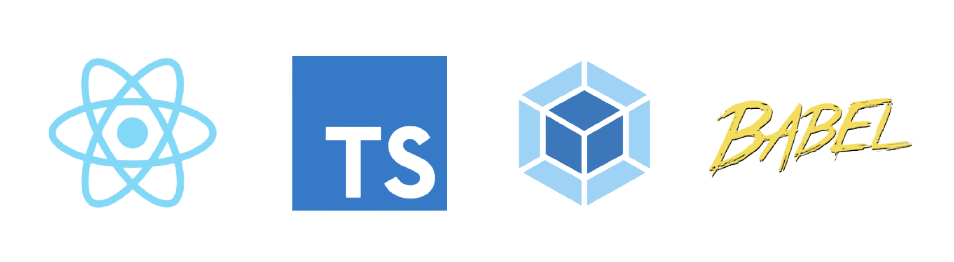

# Webpack Setup for React.js

Mininal Webpack and React.js Starter boilerplate from <https://github.com/fariasmateuss/webpack-setup-for-react>

Added jest & React Testing Library

## Deployment

To deploy run the following command:

```bash
yarn build
```

The build will be placed in the `build` directory.

If you want to deploy to a different directory, you can specify the directory changing the path in the webpack config.

## Scripts

- Start dev server using `yarn dev`.
- Build and bundling your resources for production `yarn build`.
- Deploy it to GitHub pages using `yarn deploy`
- `yarn type-check` validate code using TypeScript compiler.
- `yarn lint` and `yarn format` to run ESLint and Prettier for all files in the `src` directory.
- `yarn test` run jest
